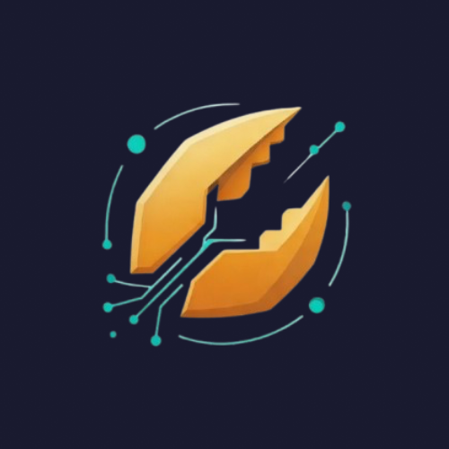
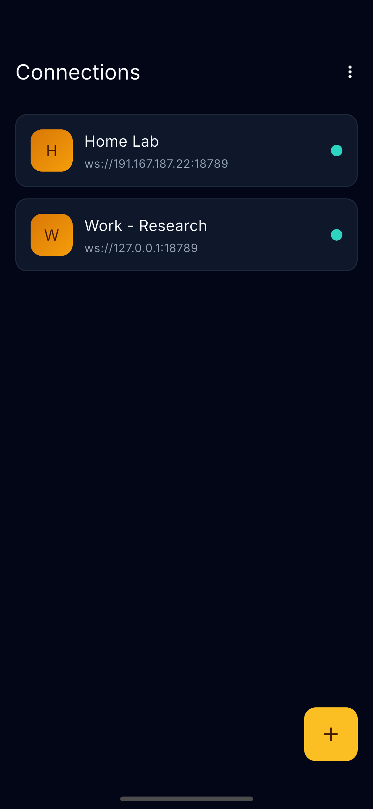
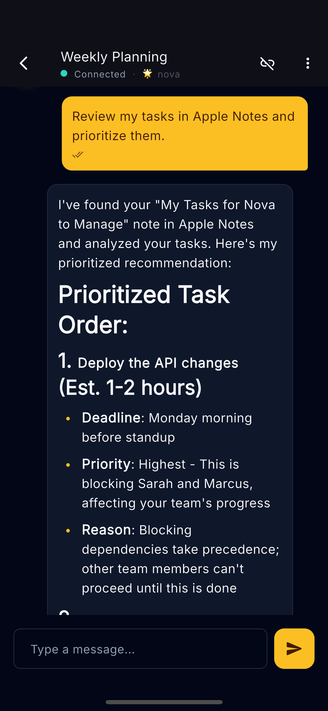
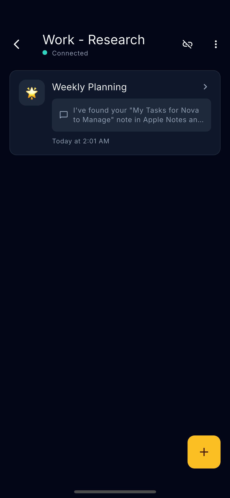
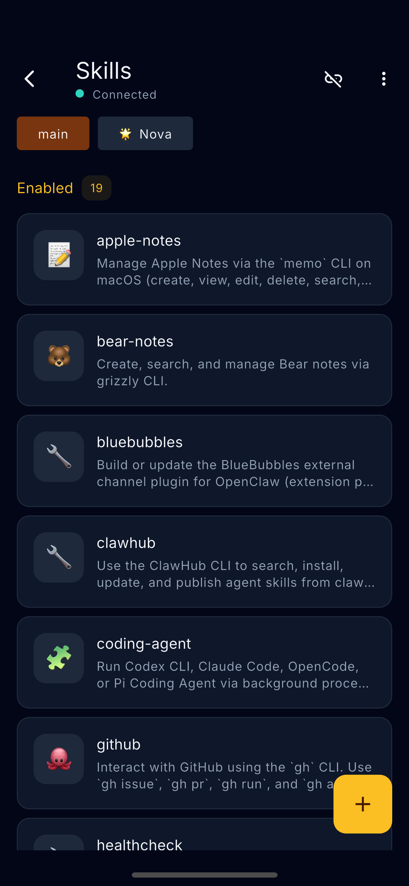
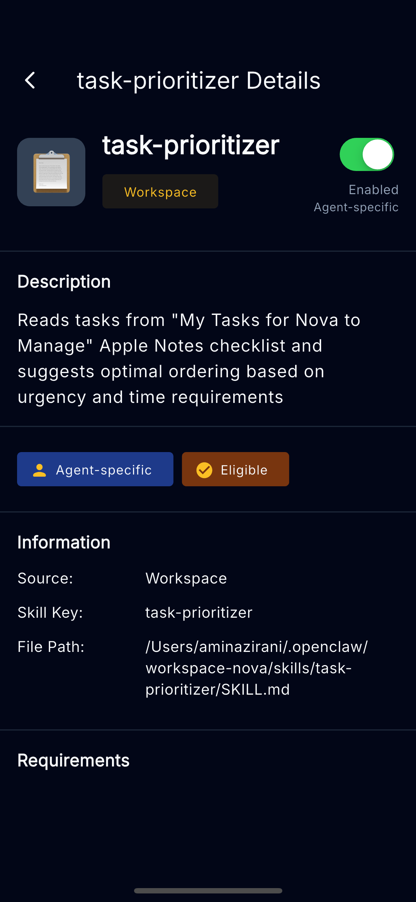
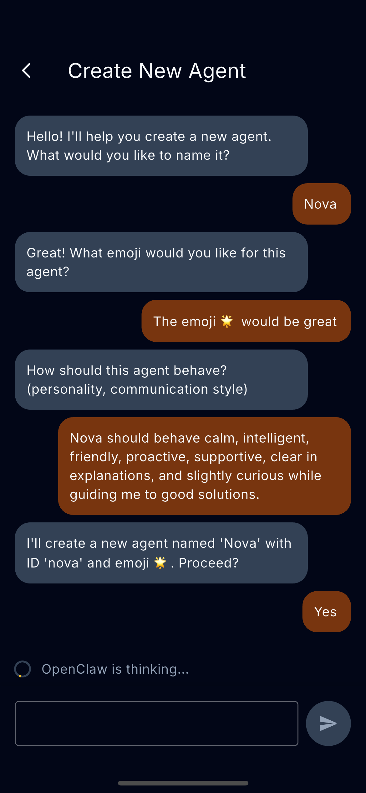
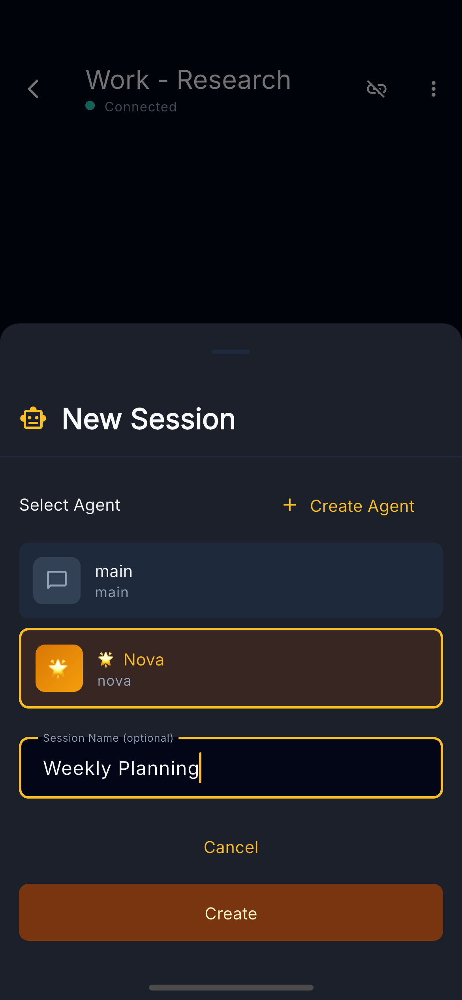
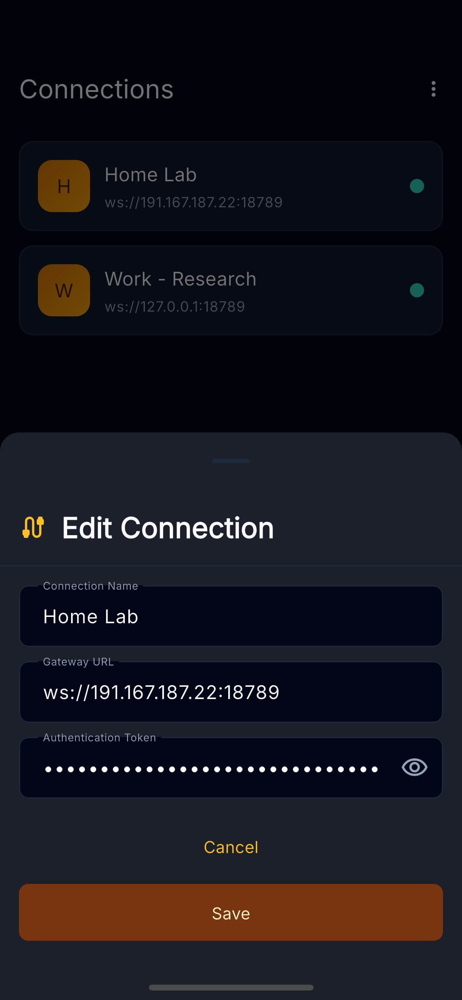
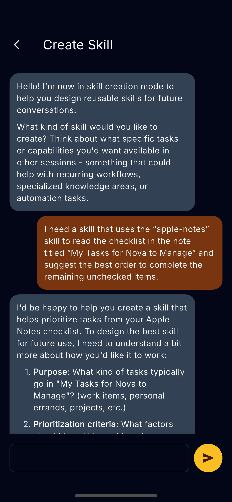

<!-- Badges -->
<div align="center">

[![CI Status][ci-badge]][ci-link]
[![Build Status][build-badge]][build-link]
[![License][license-badge]][license-link]

</div>

<!-- Header -->
<div align="center">
  

  # ClawOn

  **One app. All your OpenClaw gateways. Every platform.**

  A cross-platform flutter based client for [OpenClaw](https://github.com/openclaw) — chat with AI agents, manage skills, create custom agents, and connect to multiple gateways from any device.

  **[Features](#features) • [Getting Started](#getting-started) • [Development](#development) • [Architecture](#architecture)**

</div>

---

## Features

- **Multi-Gateway Management** — Connect to and manage multiple OpenClaw gateways
- **Real-Time Chat** — Streaming AI responses with live text rendering
- **Skills Management** — Enable or disable AI capabilities per connection
- **Agent Creation** — Build custom AI agents for different tasks
- **Session Management** — Organize and browse conversation history
- **Offline Access** — View message history without an active connection
- **Cross-Platform** — iOS, Android, macOS, Windows, and Linux
- **Multi-Language** — 25 languages with RTL support (English, Spanish, French, German, Chinese, Japanese, Persian, Arabic, Urdu and more)

## Screenshots

<div align="center">
  <table>
    <tr>
      <td align="center">
        <br>
        <sub><b>Connections</b></sub>
      </td>
      <td align="center">
        <br>
        <sub><b>Chat</b></sub>
      </td>
      <td align="center">
        <br>
        <sub><b>Sessions</b></sub>
      </td>
    </tr>
    <tr>
      <td align="center">
        <br>
        <sub><b>Skills Browser</b></sub>
      </td>
      <td align="center">
        <br>
        <sub><b>Skill Detail</b></sub>
      </td>
      <td align="center">
        <br>
        <sub><b>Create Agent</b></sub>
      </td>
    </tr>
    <tr>
      <td align="center">
        <br>
        <sub><b>New Session</b></sub>
      </td>
      <td align="center">
        <br>
        <sub><b>Edit Connection</b></sub>
      </td>
      <td align="center">
        <br>
        <sub><b>Create Skill</b></sub>
      </td>
    </tr>
  </table>
</div>

## Supported Platforms

| Platform | Status |
| :------- | :----: |
| Android  |   ✅    |
| iOS      |   ✅    |
| macOS    |   ✅    |
| Windows  |   ✅    |
| Linux    |   ✅    |

## CI/CD Status

| Platform | Build Status |
| :------- | :----------- |
| Android  | [](https://github.com/aazirani/clawon/actions) |
| iOS      | [](https://github.com/aazirani/clawon/actions) |
| macOS    | [](https://github.com/aazirani/clawon/actions) |
| Windows  | [](https://github.com/aazirani/clawon/actions) |
| Linux    | [](https://github.com/aazirani/clawon/actions) |

## Prerequisites

- Flutter SDK 3.0.6 or later
- A running [OpenClaw](https://github.com/openclaw) gateway instance
- Gateway URL and authentication token

## Getting Started

### Installation

```bash
flutter pub get
flutter packages pub run build_runner build --delete-conflicting-outputs
```

### Running the App

```bash
flutter run
```

### First-time Setup

1. Launch the app — you'll be guided through onboarding
2. Go to **Connections** and tap **Add Connection**
3. Enter your OpenClaw Gateway URL (e.g., `wss://127.0.0.1:18789`)
4. Enter your authentication token
5. Start chatting with your AI agents

## Architecture

ClawOn follows **Clean Architecture** with three distinct layers:

```
lib/
├── core/              # Shared components, utilities, error handling
├── data/              # Data sources, repositories, services, models
├── domain/            # Use cases, entities, repository interfaces
└── presentation/      # MobX stores, screens, widgets
```

### State Management

MobX stores handle all reactive state:

| Store | Purpose |
|-------|---------|
| `ConnectionStore` | WebSocket connection state |
| `ChatStore` | Message list and sending |
| `ConnectionsStore` | Multiple connections management |
| `SkillsStore` | Skills browsing and toggling |
| `LanguageStore` | Language switching |

## Development

### Code Generation

After modifying MobX stores or Drift database tables:

```bash
flutter packages pub run build_runner build --delete-conflicting-outputs
```

Watch mode for continuous generation:

```bash
flutter packages pub run build_runner watch
```

### Testing

```bash
# Run all tests
flutter test

# Run a specific test file
flutter test test/path/to/test_file.dart
```

### Code Analysis

```bash
flutter analyze
```

### Building for Release

```bash
# Android
flutter build apk --release

# iOS
flutter build ios --release

# macOS
flutter build macos --release

# Windows
flutter build windows --release

# Linux
flutter build linux --release
```

## Key Dependencies

| Package | Purpose |
|---------|---------|
| `mobx` / `flutter_mobx` | Reactive state management |
| `drift` | SQLite ORM for local storage |
| `web_socket_channel` | WebSocket communication |
| `go_router` | Declarative navigation |
| `get_it` | Dependency injection |
| `flutter_markdown` | Markdown rendering for agent responses |
| `shared_preferences` | Key-value storage |

## Troubleshooting

### Connection Issues

- Verify the gateway URL includes the correct protocol (`wss://` for secure, `ws://` for unsecured)
- Ensure the token is valid and has not expired
- Check that the gateway is accessible from your network

### Build Issues

If you get errors after modifying stores or database tables, run the code generation command. For persistent build issues:

```bash
flutter clean
flutter pub get
flutter packages pub run build_runner build --delete-conflicting-outputs
```

## License

This project is licensed under the MIT License — see the [LICENSE](LICENSE) file for details.

<!-- Badge Links -->
[ci-badge]: https://img.shields.io/github/actions/workflow/status/aazirani/clawon/ci.yml?branch=main&label=ci
[ci-link]: https://github.com/aazirani/clawon/actions/workflows/ci.yml
[build-badge]: https://img.shields.io/github/actions/workflow/status/aazirani/clawon/build.yml?branch=main&label=build
[build-link]: https://github.com/aazirani/clawon/actions/workflows/build.yml
[license-badge]: https://img.shields.io/github/license/aazirani/clawon
[license-link]: LICENSE
